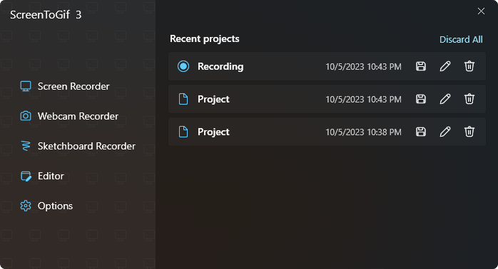

# Welcome to a new era for ScreenToGif!

I'm thrilled to announce the release of **ScreenToGif 3.0**!  
This major update brings a host of new features, improvements, and optimizations to enhance your user experience.  

## Key Highlights

### 1. Sleek New User Interface

Say hello to a modern and intuitive user interface! 
I've completely redesigned the look and feel of ScreenToGif to make it more visually appealing and user-friendly.

### 2. Powerful Performance Boost

I've fine-tuned the software engine to provide a significant performance boost.  
Enjoy faster loading times, smoother transitions, and an overall more responsive experience.  

### 3. Exciting New Features

- **Feature A**: Introducing an innovative feature that will revolutionize how you [perform a specific task].
- **Feature B**: A highly requested feature that allows you to [accomplish another task] with ease.

## What's Next?

I'm committed to continuous improvement, and your feedback is invaluable. 
If you encounter any issues or have suggestions for future enhancements, please don't hesitate to [contact me](https://www.screentogif.com/contact).

Thank you for being a part of the ScreenToGif community. 
I hope you enjoy using version 3.0 as much as I enjoyed creating it!